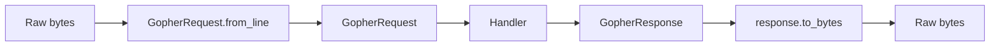
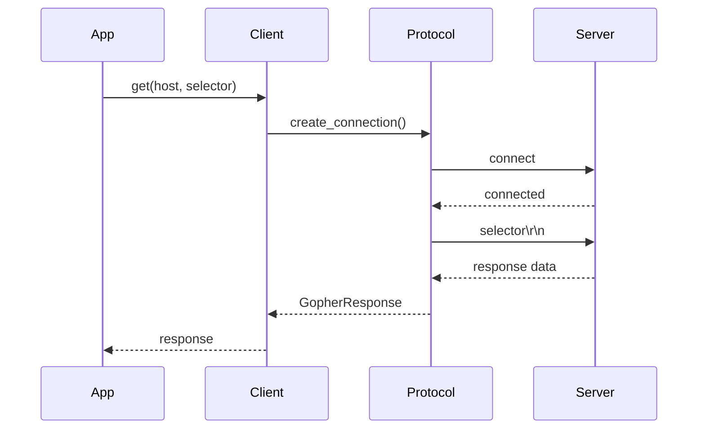
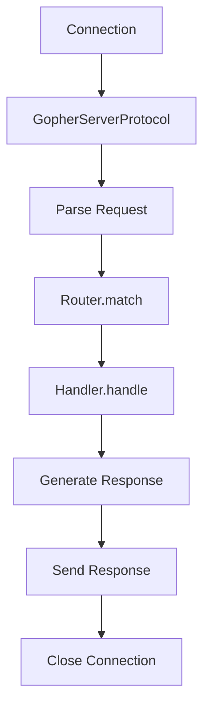

# Architecture

An overview of Mototli's design, module structure, and key patterns.

## Design Principles

Mototli follows these principles:

### Modern Python

- **Python 3.10+** minimum version
- **Type hints** throughout for IDE support and static analysis
- **Async/await** for efficient I/O
- **Dataclasses** for clean data structures

### Protocol Separation

The protocol layer is separate from I/O concerns:

```
protocol/     # Pure data structures, no I/O
├── request.py
├── response.py
└── attributes.py

client/       # Network I/O
└── session.py

server/       # Network I/O
└── server.py
```

This makes protocol types easy to test and reuse.

### Asyncio Native

Both client and server use asyncio's Protocol/Transport pattern:

```python
class GopherClientProtocol(asyncio.Protocol):
    def connection_made(self, transport):
        ...
    def data_received(self, data):
        ...
```

This provides:

- Non-blocking I/O
- Efficient connection handling
- Clean resource management

## Module Structure

```
src/mototli/
├── __init__.py
├── __main__.py          # CLI entry point
├── protocol/            # Protocol layer (no I/O)
│   ├── __init__.py
│   ├── constants.py     # DEFAULT_PORT, CRLF, etc.
│   ├── item_types.py    # ItemType enum
│   ├── request.py       # GopherRequest, RequestType
│   ├── response.py      # GopherItem, GopherResponse
│   └── attributes.py    # Gopher+ attributes
├── client/              # Client implementation
│   ├── __init__.py
│   ├── protocol.py      # GopherClientProtocol
│   └── session.py       # GopherClient high-level API
├── server/              # Server implementation
│   ├── __init__.py
│   ├── server.py        # GopherServer
│   ├── protocol.py      # GopherServerProtocol
│   ├── config.py        # ServerConfig
│   ├── router.py        # Request routing
│   ├── handler.py       # Request handlers
│   └── cgi.py           # CGI execution
├── content/             # Content generation
│   ├── __init__.py
│   ├── directory.py     # Directory listings
│   └── attributes.py    # Gopher+ attribute generation
└── utils/               # Utilities
    ├── __init__.py
    └── mime.py          # MIME type detection
```

## Protocol Layer

### Request/Response Flow



### GopherRequest

Represents an incoming request:

```python
@dataclass(frozen=True)
class GopherRequest:
    selector: str
    search_query: str | None
    request_type: RequestType
    view_type: str | None

    @classmethod
    def from_line(cls, line: bytes) -> "GopherRequest":
        # Parse wire format
        ...

    def to_bytes(self) -> bytes:
        # Serialize to wire format
        ...
```

### GopherResponse

Represents a response with items or content:

```python
@dataclass
class GopherResponse:
    items: list[GopherItem]
    content: bytes
    is_directory: bool

    @classmethod
    def from_bytes(cls, data: bytes, is_directory: bool) -> "GopherResponse":
        ...
```

### ItemType

Enum for all Gopher item types with helper properties:

```python
class ItemType(str, Enum):
    TEXT = "0"
    DIRECTORY = "1"
    ...

    @property
    def is_binary(self) -> bool:
        return self in (self.BINARY, self.GIF, self.IMAGE, ...)
```

## Client Architecture

### GopherClient

High-level API using context manager:

```python
async with GopherClient(timeout=30.0) as client:
    response = await client.get(host, selector)
```

Internally creates a new connection for each request (Gopher is connectionless).

### Connection Flow



## Server Architecture

### Request Handling Pipeline



### Router

Matches requests to handlers:

```python
router = Router()
router.add_route("/cgi-bin/", cgi_handler, RouteType.PREFIX)
router.add_route("/about", about_handler, RouteType.EXACT)

handler = router.match("/cgi-bin/script.py")  # Returns cgi_handler
```

### Handler Chain

Handlers process requests:

```python
class RequestHandler(Protocol):
    async def handle(self, request: GopherRequest) -> GopherResponse:
        ...
```

Built-in handlers:

- **StaticFileHandler** - Serve files from disk
- **CGIHandler** - Execute CGI scripts
- **ErrorHandler** - Generate error responses

### ServerConfig

Configuration with TOML support:

```python
config = ServerConfig.from_toml("server.toml")
server = GopherServer(config)
```

## Content Generation

### Directory Listings

Auto-generated when no gophermap exists:

```python
from mototli.content import generate_directory_listing

response = generate_directory_listing(
    path=Path("/var/gopher/subdir"),
    selector="/subdir",
    hostname="gopher.example.com",
    port=70
)
```

### Gopher+ Attributes

Generated for files and directories:

```python
from mototli.content import generate_attributes

attrs = generate_attributes(
    path=Path("/var/gopher/file.txt"),
    selector="/file.txt",
    config=server_config
)
```

## Error Handling

### Client Errors

The client raises standard Python exceptions:

```python
try:
    response = await client.get(host, selector)
except TimeoutError:
    # Connection timed out
except ConnectionRefusedError:
    # Server not running
except OSError:
    # Network error
```

### Server Errors

The server catches exceptions and returns Gopher error responses:

```python
3Error: File not found	error	server.example	70
```

## Testing Strategy

### Unit Tests

Test protocol parsing independently:

```python
def test_request_parsing():
    request = GopherRequest.from_line(b"/selector\r\n")
    assert request.selector == "/selector"
```

### Integration Tests

Test client-server interaction:

```python
async def test_client_server():
    server = await start_test_server()
    async with GopherClient() as client:
        response = await client.get("localhost", "/")
    await server.stop()
```

## Extension Points

### Custom Handlers

Implement the handler protocol:

```python
class MyHandler:
    async def handle(self, request: GopherRequest) -> GopherResponse:
        # Custom logic
        return GopherResponse(content=b"Hello")
```

### Custom Routing

Add routes programmatically:

```python
router.add_route("/api/", api_handler, RouteType.PREFIX)
```

## Performance Considerations

### Connection Per Request

Gopher creates a new connection per request. For bulk operations, consider:

- Parallel requests with `asyncio.gather`
- Connection pooling (not standard for Gopher)

### Large Files

For large files:

- Set appropriate `max_file_size` limit
- Use Gopher+ to check size before download
- Consider streaming (not native to Gopher)

## See Also

- [:octicons-arrow-right-24: Protocol API](../reference/api/protocol.md) - Protocol types
- [:octicons-arrow-right-24: Server API](../reference/api/server.md) - Server classes
- [:octicons-arrow-right-24: Client API](../reference/api/client.md) - Client classes
