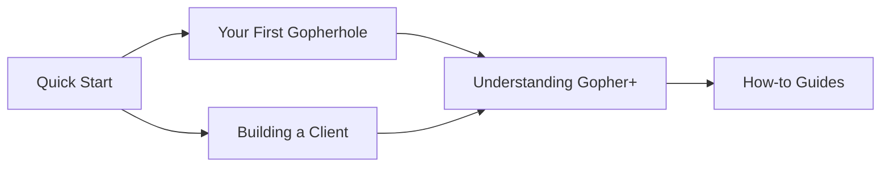

# Tutorials

Step-by-step guides to learn Mototli from the ground up. Each tutorial is self-contained and builds practical skills.

-   :material-server: **Your First Gopherhole**

    ---

    Create and serve your first gopher site with text files, directory structure, and a custom gophermap.

    **Difficulty**: Beginner
    **Time**: ~15 minutes

    [:octicons-arrow-right-24: Start tutorial](your-first-gopherhole.md)

-   :material-download: **Building a Client**

    ---

    Build an async Python client to browse gopherspace, parse directory listings, and download content.

    **Difficulty**: Intermediate
    **Time**: ~20 minutes

    [:octicons-arrow-right-24: Start tutorial](building-a-client.md)

-   :material-plus-circle: **Understanding Gopher+**

    ---

    Learn Gopher+ extensions including attribute queries, alternate views, and admin information.

    **Difficulty**: Intermediate
    **Time**: ~25 minutes

    [:octicons-arrow-right-24: Start tutorial](understanding-gopher-plus.md)

## Prerequisites

Before starting these tutorials, you should:

- Have Mototli [installed](../installation.md)
- Be comfortable with Python basics (async/await is covered)
- Have a terminal available

## Learning Path

## After Completing Tutorials

Once you've completed these tutorials, explore:

- [:octicons-arrow-right-24: How-to Guides](../how-to/index.md) - Task-oriented problem-solving
- [:octicons-arrow-right-24: Reference](../reference/index.md) - Complete API documentation
- [:octicons-arrow-right-24: Explanation](../explanation/index.md) - Deep dives into concepts
